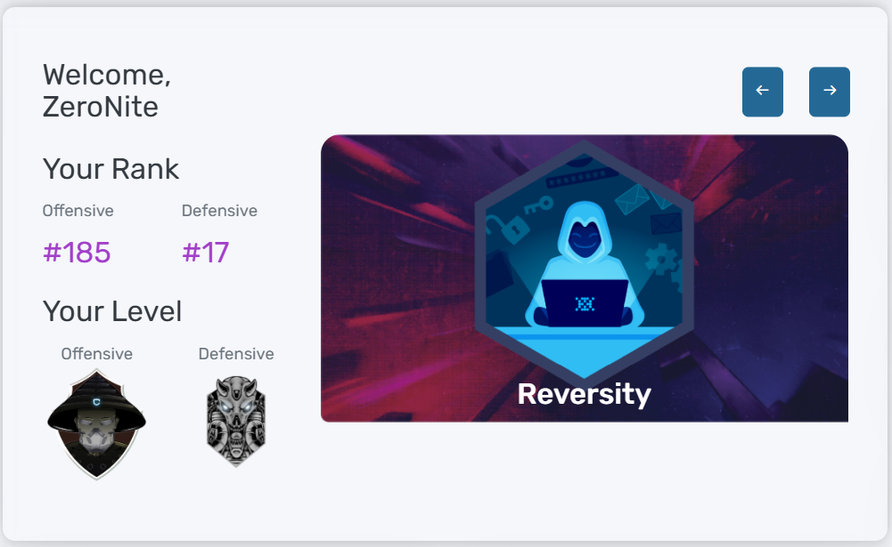

# Hi there, I'm Yoga Samudra! 👋

## 🔒 About Me

I am an **Informatics Engineering graduate** specializing in **Cybersecurity**, with a balanced expertise in both **Offensive (Red Team)** and **Defensive (Blue Team)** security environments. 

- 🔴 **Offensive Security:** Experienced in conducting vulnerability assessments and penetration testing to identify and mitigate potential security flaws before they can be exploited.
- 🔵 **Defensive Security:** Skilled in security monitoring, log analysis, network traffic analysis, and threat detection to maintain infrastructure integrity and resilience.

---

## 🏆 Achievements

- 🥇 **Top 20 Rank Defensive** – Hacktrace Ranges CTF
  

---

## 🛠️ Cyber Security Toolkit & Tech Stack


### ⚙️ Development & Infrastructure


---

## 📊 Core Specializations

```text
🔴 OFFENSIVE: Penetration Testing | Vulnerability Assessment
🔵 DEFENSIVE: Security Monitoring | Log Analysis | PCAP Analysis | Threat Intelligence
🌐 NETWORKING: TCP/IP Architecture | Network Security | IDS/IPS Deployment
```

---

## 🤝 Connect with Me

* 💼 **LinkedIn:** [linkedin.com/in/yoga-samudra](linkedin.com/in/yoga-samudra)
* 📧 **Email:** [08samudra@gmail.com](mailto:08samudra@gmail.com)

<p align="center">

  

</p> 

---